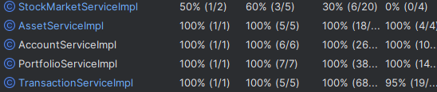

# What If Trading Application

## Overview
The "What If Trading" application allows users to simulate trading in the Borsa Istanbul stock market. This platform enables users to assess their trading performance and determine whether their strategies would be viable in the real world, all without the risk of losing money.

## Technical Stack

### Backend
- **Framework**: Spring Boot
- **Language**: Java
- **APIs**: RESTful APIs created to handle trading operations and user interactions.
- **Stock Prices**: Integrated with the [Financial Modeling Prep API](https://site.financialmodelingprep.com/) to fetch end-of-day stock prices (note: the free API does not provide real-time prices).
- **Scheduled Operations**: The application retrieves stock prices and performs operations every weekday at 18:30.
- **API Documentation**: Swagger is utilized for clear and user-friendly documentation of the APIs.

### Frontend
- **Framework**: React.js
- **Development Stage**: The frontend will be developed after the completion of the backend.

## Testing
- **Unit Testing**: All services have been thoroughly unit tested using JUnit to verify the correct behavior of backend components.
- **Test Framework**: JUnit 5 and Mockito were used for writing and executing the unit tests.

## Features
- **Account Management**: Customers can open account within the app.
- **Multiple Portfolios**: Users can create multiple portfolios, giving each a unique name and applying different strategies.
- **Transaction Tracking**: Portfolio transactions and assets are saved for user reference.
- **Buy/Sell Functionality**: Customers can buy or sell stocks for their selected portfolios.
- **Simulated Trading**: Users can practice trading strategies without financial risk.
- **Performance Tracking**: Users can monitor their trading performance to make informed decisions.

## Future Enhancements
- ~~Unit testing for services~~ (Completed)
- User authentication and authorization (using Spring Security)
- Additional analytics and reporting features